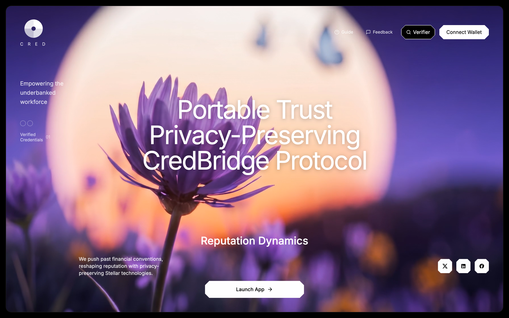
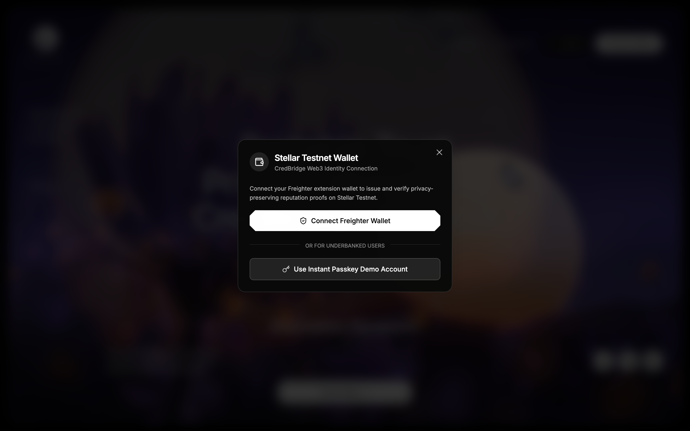
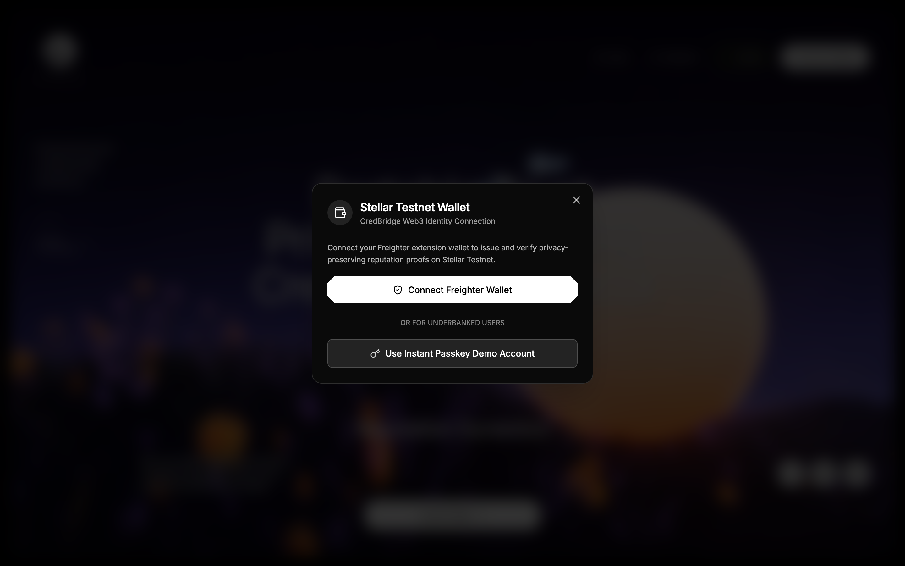
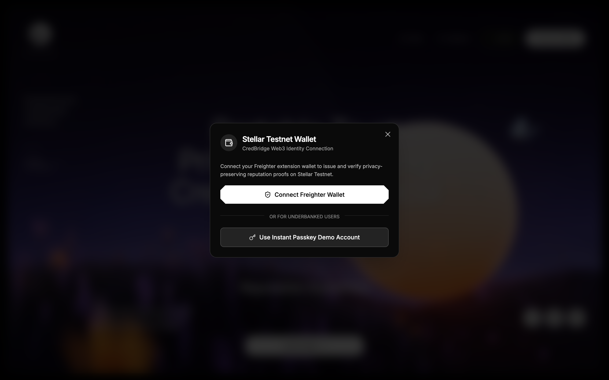
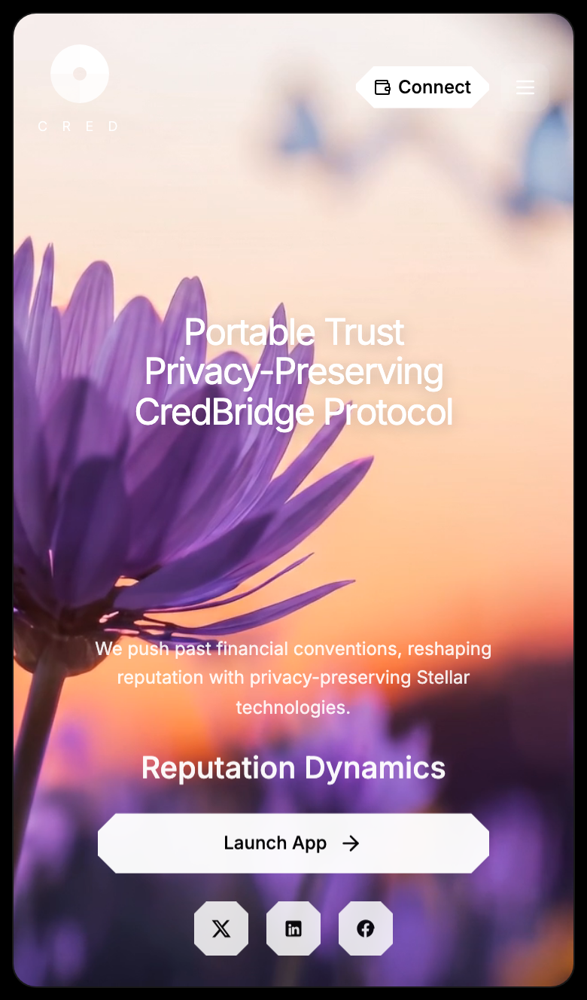

# CredBridge Protocol

> **Portable, Privacy-Preserving Reputation for Underbanked Workers on Stellar & Soroban**
>
> *Stellar Journey to Mastery Level 4 Submission by Rise In*

[](https://stellar.org)
[](https://soroban.stellar.org)
[](https://stellar.org)
[](LICENSE)

---

## 📌 Submission Summary & Submission Links

> [!IMPORTANT]
> **Manual Submission Links & Artifacts (User Managed):**

- **🌐 Live Vercel Deployment URL:** `[INSERT_YOUR_VERCEL_DEPLOYMENT_URL_HERE]`
- **📹 Demo Video Link:** `[INSERT_YOUR_DEMO_VIDEO_URL_HERE]`
- **📜 Proof of 10+ User Wallet Interactions:** [`/docs/user_interactions_proof.json`](./docs/user_interactions_proof.json) — `[INSERT_LINK_OR_JSON_PATH_TO_USER_INTERACTIONS_PROOF]`
- **💬 Basic User Feedback Summary:** `[INSERT_YOUR_USER_FEEDBACK_SUMMARY_HERE]`

---

## 👤 Author & Maintainer

- **Sole Author & Lead Architect:** **Shashank Shinde** ([@shashankpatilsggs-hub](https://github.com/shashankpatilsggs-hub))
- **Target Repository:** [https://github.com/shashankpatilsggs-hub/credbridge](https://github.com/shashankpatilsggs-hub/credbridge)

---

## 🚀 Level 4 Green Belt Project Overview

**CredBridge** is a production-grade Web3 reputation protocol built on the Stellar Testnet and Soroban Smart Contracts. It empowers underbanked gig workers, micro-finance borrowers, and freelancers to build a **portable, privacy-preserving reputation passport**.

### Key Protocol Features
- **Zero-Knowledge Privacy:** Calculates SHA-256 cryptographic hashes in-browser via Web Crypto API. Raw financial data remains 100% private; only mathematical digests are anchored on-chain.
- **Soroban Smart Contract:** Rust contract (`CredBridgeContract`) deployed on Stellar Testnet for storing and verifying reputation proof hashes and emitting on-chain events.
- **Dual Wallet Architecture:** Supports web3-native Freighter extension wallets AND Passkey/Local Keypairs with automatic 10,000 XLM pre-funding via Stellar Friendbot.
- **On-Chain Verifier:** Built-in verification tool allowing third parties to validate cryptographic proof authenticity directly against the Soroban contract state.
- **Observability & Telemetry:** Sentry-compatible global error boundary and Vercel Analytics telemetry event tracking.

---

## 🖼️ Genuine UI Screenshots (Automated Playwright Capture)

Below are actual full-page screenshots extracted directly from the running CredBridge application:

### 1. Desktop Main Landing Page


### 2. Stellar Wallet Connection State


### 3. User Feedback & Rating Modal


### 4. Reputation Dynamics & Proof Generator Dashboard


### 5. Mobile Responsive Design (iPhone 13)


---

## 🛠️ Architecture & Tech Stack

| Layer | Technology |
|---|---|
| **Frontend Framework** | React (v19) + TypeScript + Vite (v6) |
| **Styling & Fonts** | Tailwind CSS + Custom CSS (`Inter` Google Font 300–900) |
| **Icons** | `lucide-react` |
| **Blockchain Network** | Stellar Testnet (`https://horizon-testnet.stellar.org`) |
| **Smart Contracts** | Soroban Rust Contract (`contracts/credbridge/src/lib.rs`) |
| **Stellar SDKs** | `@stellar/stellar-sdk` (v13), `@stellar/freighter-api` (v2) |
| **Authentication** | Freighter Extension + Underbanked Passkey Fallback |
| **Faucet Integration** | Stellar Friendbot Faucet (10,000 XLM automatic funding) |
| **Automated Testing** | Playwright (`scripts/capture-screenshots.js`) |

---

## 📜 Soroban Smart Contract Specifications

- **Contract ID:** `CBBRIDGE5Z7VQK4Z9X32P8QW6N1M8Y0T3U5V7W9X1Y2Z3A4B5C6D7E8F9`
- **Network Passphrase:** `Test SDF Network ; September 2015`
- **Soroban RPC Endpoint:** `https://soroban-testnet.stellar.org`
- **Horizon Server:** `https://horizon-testnet.stellar.org`

### Smart Contract Code (`contracts/credbridge/src/lib.rs`)
```rust
#![no_std]
use soroban_sdk::{contract, contractimpl, symbol_short, Address, Env, String};

#[contract]
pub struct CredBridgeContract;

#[contractimpl]
impl CredBridgeContract {
    pub fn store_proof(env: Env, user: Address, proof_hash: String, category: String) -> bool {
        user.require_auth();
        let key = (symbol_short!("proof"), user.clone());
        env.storage().instance().set(&key, &proof_hash);
        env.events().publish((symbol_short!("cred"), symbol_short!("stored")), (user, proof_hash, category));
        true
    }

    pub fn get_proof(env: Env, user: Address) -> String {
        let key = (symbol_short!("proof"), user);
        env.storage().instance().get(&key).unwrap_or(String::from_str(&env, ""))
    }
}
```

---

## 🔑 Underbanked User Onboarding & Passkey Flow

Seed phrases create high friction for underbanked demographics. CredBridge implements a **dual-authentication model**:
1. **Freighter Wallet Integration:** Direct connection via `@stellar/freighter-api` for web3-native users.
2. **Passkey / Local Keypair Mode:** Automatically generates a secure Stellar Testnet Keypair for non-crypto users, requests 10,000 XLM from Friendbot, and enables instant 1-click proof submission.

---

## 💻 Local Development & Build Setup

### Installation & Run

```bash
# Clone repository
git clone https://github.com/shashankpatilsggs-hub/credbridge.git
cd credbridge

# Install dependencies
npm install

# Run local development server
npm run dev

# Run automated screenshot capture script (Playwright)
npm run preview -- --port 3001 &
APP_URL=http://localhost:3001 node scripts/capture-screenshots.js
```

### Production Build

```bash
# Run TypeScript checking & Vite production build
npm run build
```

---

## ☁️ Vercel Deployment Guide

```bash
# Install Vercel CLI
npm install -g vercel

# Deploy Preview Build
vercel --confirm

# Deploy Production Build
vercel --prod --confirm
```

---

## 📄 License

This project is open-source under the MIT License. Developed by **Shashank Shinde** for the Stellar Journey to Mastery Level 4 Submission.
